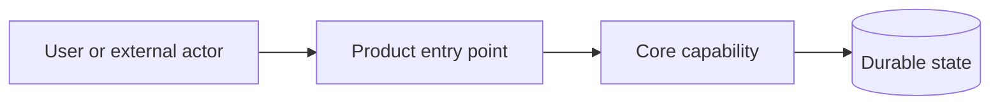
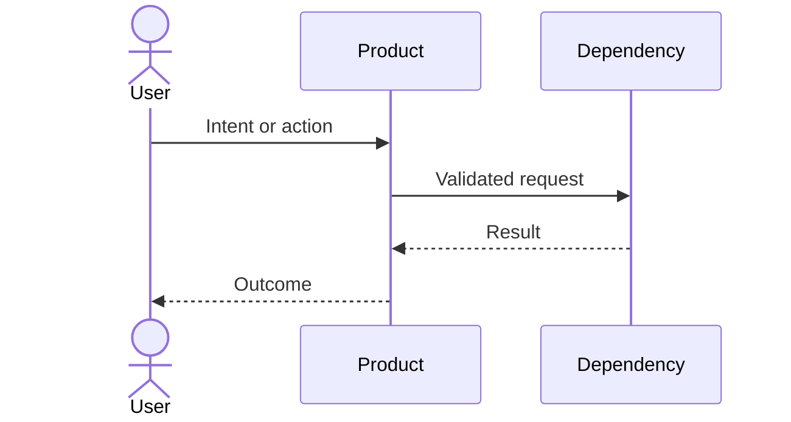
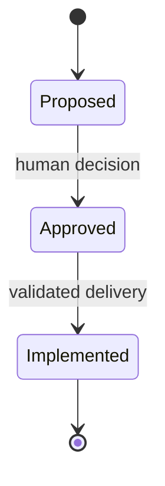

# Architecture Diagrams — [Project]

Use only the sections that improve understanding. Delete unused examples.

## System/component flow

Explain scope, boundaries and any inference that still needs confirmation.

## Critical interaction

## Lifecycle

## Diagram rules

- Prefer the smallest diagram that answers a real question.
- Keep business rules in canonical prose/tests as well as explanatory diagrams.
- Label proposals and inferences; do not render them as accepted current state.
- Update or remove a diagram when its owner changes.
- Avoid decorative complexity, undocumented colors and layout-only duplication.
