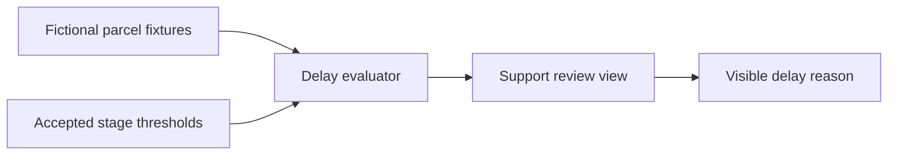

# Architecture Context — Parcel Pulse

## Accepted prototype direction

A local-first prototype separates fictional input, delay evaluation and the
support-facing view. No external boundary is implemented.

## Boundaries

- Fixtures contain no real identifiers or endpoints.
- The evaluator owns threshold comparison, not presentation code.
- A future carrier adapter is outside the prototype and requires a new decision.

## Related decision

- `docs/adr/0001-local-first-prototype.md`
